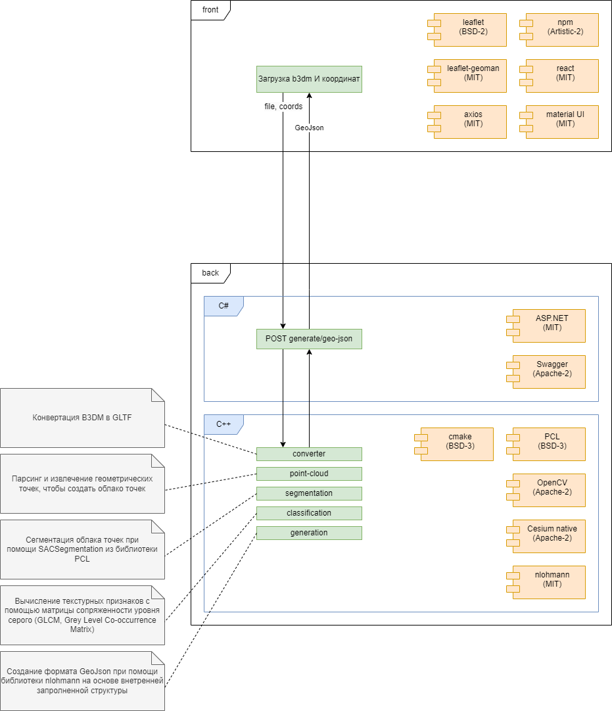

Проект создан для генерации GeoJson на основе предоставленных файлов b3dm с инструментарием для подправки зон.

Так же для простоты имеется схема проекта geozilla-scheme.drawio.

# Запуск

Для простого запуска программы были написаны два скриптовых файла, которые необходимо просто запустить.

- run-back.bat

Чтобы запустить локально веб сервер (бек часть). Данный скрипт склонит и сбилдит необходимые библиотеки и заупустит сервер.

- run-front.bat

Запуск локальной фронтовой части сайта. Доступ по адресу http://localhost:3000. Так же будет через npm подтягивать необходимые пакеты.

# Сборка geozilla-core

## Программное обеспечение

Для сборки geozilla-core потребуется:
- Visual Studio 2022 (Desktop development with c++)
- CMake минимум версии 3.15
- Git

## Шаги для сборки

1. Скачать все модули с помощью команды: `git submodule update --init --recursive`
1. Перейти в директорию `geozilla/geozilla-core/external/vcpkg`
1. Выполнить команду `.\bootstrap-vcpkg.bat`
1. Установить библиотеку PCL: `.\vcpkg install pcl`
1. Перейти в директорию: `geozilla/geozilla-core`
1. Сгенерировать решение Visual Studio: `cmake -G "Visual Studio 17 2022" -B build`
1. Собрать Debug версию решения: `cmake --build build --config Debug`
1. Собрать Release версию решения: `cmake --build build --config Release`

## Примечание

При сборке решения может появиться ошибка об отсутсвии `version.h` файла. Возможные способы решения можно найти по ссылке: https://github.com/KhronosGroup/KTX-Software/issues/550

# Стек технологий

## Frontend
1. npm (Artistic-2)
1. react (MIT)
1. material UI (MIT)
1. axios (MIT)
1. leaflet (BSD-2)
1. leaflet-geoman (MIT)

## Backend
1. ASP.NET (MIT)
1. Swagger (Apache-2)
1. PCL (BSD-3)
1. OpenCV (Apache-2)
1. Cesium native (Apache-2)
1. nlohmann (MIT)
1. cmake (BSD-3)

# Общая схема

